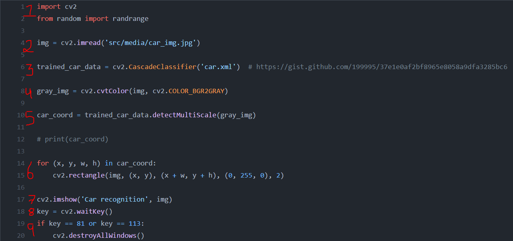

# Using [Open CV](https://opencv.org/about/) 
  
### Projects:

1. _Face recognition on images._
2. _Face recognition in real time._
3. _Car recognition._
4. _Car & pedestrian recognition._
5. _Smile recognition._


**What's _Open CV_?**

**Open** Source **C**omputer **V**ision is a computer vision and machine learning software library.
It has more than 2500 optimized algorithms, including _classic & state-of-the-art computer vision_ and _machine learning_. 

It has C++, Python, Java and Matlab interfaces and supports Windows, Linux, Android, and MacOS. 

Some uses of this algorithms are face recognition, identificate objects, classify human actions, tracking movements and more. For these projects I'll be using 4 of these algorithms which are:

- Project 1, 2 & 5: [haarcascade_frontalface_default.xml](https://github.com/opencv/opencv/blob/master/data/haarcascades/haarcascade_frontalface_default.xmlhttps://github.com/opencv/opencv/blob/master/data/haarcascades/haarcascade_frontalface_default.xml)
- Project 3: [car.xml](https://github.com/andrewssobral/vehicle_detection_haarcascades/blob/master/cars.xml)
- Project 4: [haarcascade_fullbody.xml](https://github.com/opencv/opencv/blob/master/data/haarcascades/haarcascade_fullbody.xml)
- Project 5: [haarcascade_smile.xml](https://github.com/opencv/opencv/blob/master/data/haarcascades/haarcascade_smile.xml)

_[Here](https://github.com/opencv/opencv) you can find all the algorithms and more files from **OpenCV**._

In order to review every project just select on the branches section the one of your interest, but before let's explain how the code is 
structured.

Even though we have 3 different projects, they share the same code structure:

1. Import **OpenCV** library.
   
   ```import cv2```
2. Define the source to be analysed (photo, video or webcam) and save it in a variable.
   
   ```img = cv2.imread('src/media/car_img.jpg')```
3. Create a variable where we save the _haarcascade algorithm_ that we want to use.
   
   ```trained_car_data = cv2.cascadeClassifier("car.xml")```
4. Convert the source in black & white.
   
   ```gray_img = cv2.cvtColor(img, cv2.COLOR_BGR2GRAY)```
5. Then using _detectMultiScale_, we get the coordinates of the object we want to analyse.
   
   ```car_coord = trained_car_data.detectMultiScale(gray_img)```
6. Using _for_ loop, we save the coordinates-data on variables _(x ,y ,w, h)_ and then with the 
function _cv2.rectangle_ we are able to draw a rectangle.

```
for (x,y, w,h) in car_coord:
      cv2.rectangle(img, (x,y), (x+w, y+h), (0, 255,0), 2)
  ```
_Inside ```rectangle()``` function we have:_ _source, (x, y coordinates), (we add width & length), (RGB values), line thickness._
7. We show the picture or video, and we add a title to the pop up Window.
   
```cv2.imshow('Car recognition', img)```
8. Important line in order to make everything runs.
   
```key = cv2.waitKey()```
9. We just conclude with a _if_ loop that helps us to stop the program, where **81** and **113**
   correspond to **q** and **Q** in _ASCII_, as we type it the program stops.
   
```
if key == 81 or key == 113:
    cv2.destroyAllWindows()
```



## Now let's move on to the projects.


